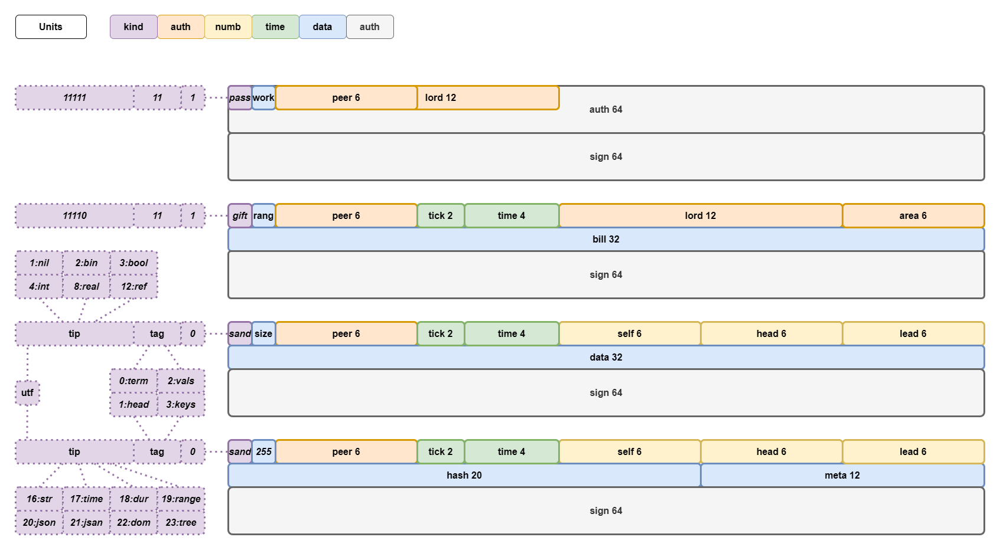
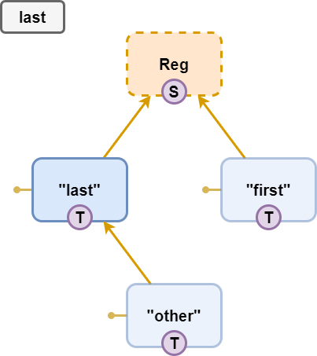
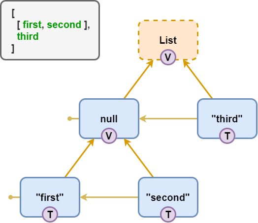
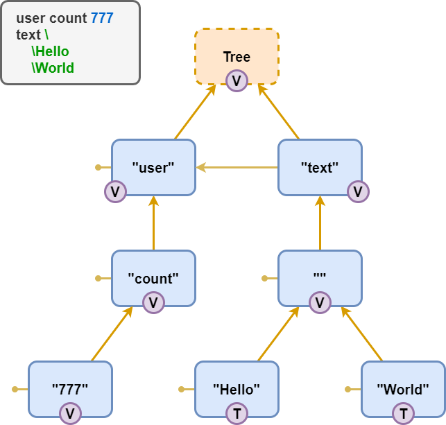
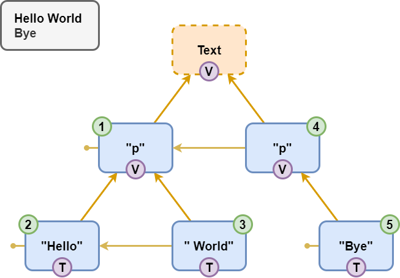
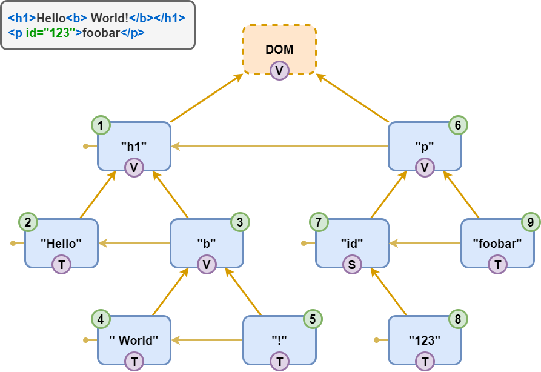
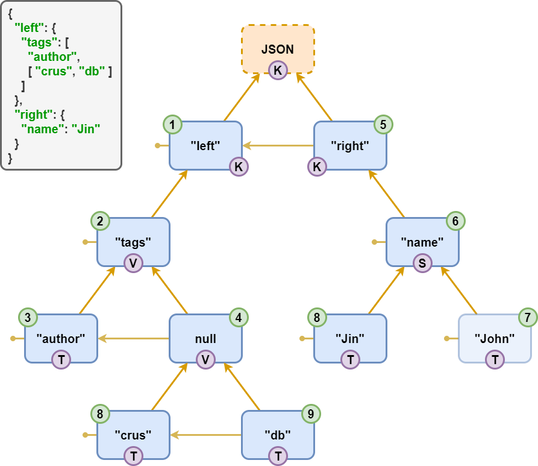
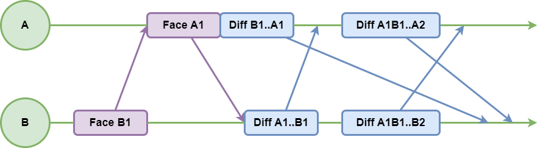
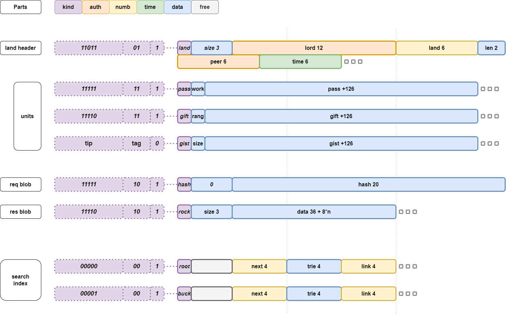

# CRUS🦿DB

> 💡 Безопасная распределённая неубиваемая база данных с бесконфликтной синхронизацией в реальном времени.

- **Convergent**: CvRDT, Total Ordered, Interleaving Free, Weak Typed
- **Realtime**: Delta Replication, WebSocket/🔜WebRTC, Inplace Updates, In Memory with Persistance
- **Unbreakable**: High availability, Partition Tolerance, Auto Recovery, Long Offline, WAL Free, Backup Free
- **Secure**: Private Key Auth, Signed Changes, Encrypted Merge, Zero-Trust, Leakage Proof
- **Decentralized**: Local First, Oracle Free, 🔜Peer to Peer
- **Brilliant**: Reactive Architecture, Graph Structure, First Class ISO8601/JSON/DOM/Tree

## Features

### 🔆 Convergent

Изменения от всех пиров неизбежно объединяются в единое для всех состояние мира.

#### CvRDT

Объединение изменений происходит без конфликтов благодаря хранению в виде бесконфликтных типов данных.

#### Total Ordered

Все данные в базе упорядочены, что даёт предсказуемый и стабильный порядок их обработки.

#### Interleaving Free

Одновремено внесённые в одно и то же место последователности не меремешиваются, а выстраиваются друг за другом.

#### Weak Typed

Возможность динамического изменения типа данных, без потери возможности слияния изменений, внесённых в разные типы.

### 💨 Realtime

Внесённые данные в реальном времени распространяются между всеми заинтересованными в них пирами.

#### Delta Replication

При синхронизации каждый пир пересылает другим пирам только недостающие им данные.

#### WebSocket/WebRTC

Двусторонняя единообразная коммуникация между всеми пирами, будь то сервера или клиенты.

#### Inplace Updates

Все юниты данных имеют одинаковый неольшой размер, что позволяет их обновлять атомарно на месте, без перемещения.

#### In Memory with Persistance

Данные хранятся в памяти, что позволяет практически не зависеть от дисковых задержек. При этом сброс в постоянное хранилище происходит в фоне.

### 💪 Unbreakable

Архитектура эффективно сопротивляется болшинству технических неполадок.

#### High availability

Благодаря локальности база данных полностью функциональна и имеет стабильное время отклика независимо от состояния сети и других узлов.

#### Partition Tolerance

Пиринговая сеть может быть разделена на произвольное число независимо работающих подсетей, которые без проблем продоолжают совместную работу при восстановлении связности.

#### Auto Recovery

Повреждённые или подложные данные детектируются и удаляются, а с других пиров затягиваются недостающие данные.

#### Long Offline

Даже после долгого оффлайна внесённые изменениия интегрируются в общую базу данных без пролем.

#### WAL Free

Так как запись происходит атомарно, то не требуется дублирование записи в иммутабельный лог на случай сбоя.

#### Backup Free

Бэкапы не требуются, так как даные легко могут быть восстановлены с других узлов сети. В том числе сервер может восстановить данные с клиентских устройств.

### 🔐 Secure

Максимальный уровень безопасности обеспечивается криптографией.

#### Private Key Auth

Аутентификация обеспечивается приватным ключом, который не передаётся другим узлам.

#### Signed Changes

Все изменения подписываются приватным ключом автора. Все узлы, при получении данных, проверяют цифровую подпись и права.

#### Encrypted Merge

Приватные данные хранятся в зашифрованном виде, что не мешает любому узлу без дешифровки осуществлять слияние авторизованных изменений.

#### Zero Trust

Все гарантии обеспечиваются алгоритмически на каждом узле. Каждый узел не доверяет никакому другому. Даже себе, ибо производит проверку даже данных, полученных с локального диска.

#### Leakage Proof

Утечка всей базы данных не приводит к раскрытиию приватных данных, так как они хранятся в зашифрованном виде. Зашифрованный секретный ключ передаётся вместе с остальными правами от одного пира другому.

### 💱 Decentralized

Все пиры равноправны, что защищает от падения или компрометации любого узла сети.

#### Local First

Все данные читаются/сохраняются локально, а потом в фоне синхронзируются с другими пирами.

#### Oracle Free

Упорядоченность состояния гарантируется алгоритмически, что не требует выделенного доверенного узла для достижения консенсуса.

#### Peer to Peer

Все узлы, работающие с базой данных, образуют связную одноранговую сеть. Любой сервер - такой же клиент базы данных, как и все остальные узлы.

### 💎 Brilliant

Элегантная крайне простая архитертура даёт при этом высокую гибкость и надёжность.

#### Reactive Architecture

Вместо удалённых вызовов и распространения событий, тут есть только работа с локальной копией БД, реакции на её текущее состояние, и фоновая синхронизация её между пирами. Состоение базы полностью определяет поведение, что позволяет спокойно перезапускать любые задачи в любой момент.

#### Graph Structure

Все данные актуально хранятся в рёбрах глобального графа, которые сгруппированы в кластеры, каждый из которых имеет свой набор разрешений и синхронзируется лениво-атомарно.

#### First Class ISO8601/JSON/DOM/Tree

Популярные модели данных являются частными случаями используемой в базе данных.

## Vocabulary

- **🌌Realm** - Whole global graph database which contains Lands.
- **🌍Land** - Standalone part of Realm which syncs separately, have own rights, and contains Units.
  - **🏠Home** - Land where Lord is King. Contains only ain info.
  - **🎶Hall** - Lord's profile with full info.
- **Lord** - Independent actor with global unique id generated from Auth key.
  - **🤴King** - Lord who have ful rights to Land (with same id).
- **Area** - Land local Node id namespace.
  - **Data** - Common user info.
  - **Meta** - Land meta info.

- **Auth** - Private key generated with Proof of Work.
- **Peer** - Land local unique identifier of independent actor (first half of Lord).
- **Sign** - Crypto sign of whole Unit data xored with Land id.

- **🧩Node** - High level representation of stored data.
  - **Atom** - Atomic LWW-register.
  - **List** - Mergeable ordered list.
  - **Dict** - Mergeable ordered dictionary.
  - **Text** - Mergeable plain text.
  - **DOM** - Mergeable Docuent Object Model.
  - **Tree** - Mergeable Abstract Syntax Tree.

- **Unit** - Minimal independent stable part of information. Actually it's edge between nodes in graph model.
  - **🔑Pass** - Public key of Peer.
  - **🏅Give** - Rights and secret key given to Peer.
  - **📦Gist** - (Meta) Data.

- **🆔Self** - Self Node id
- **🎃Head** - Parent Node id.
- **👈Prev** - Previous Node id in the siblings list.
- **👉Next** - Next Node id in the siblings list.
- **💺Seat** - Position in the list.
- **🎭Tag** - Hint how interpretate inner Units.
  - **💼term** - irnore.
  - **🔝solo** - ignore all after first.
  - **🎹vals** - list of values.
  - **🔑keys** - list of keys.

- **Time** - Monotonic time as count of ms from unix epoch.
- **Data** - Serialized inforation. Up to 32B.
- **💎Hash** - SHA-1 hash of large info.
- **🗻Rock** - BLOB identified by Hash.

- **🎡Vary** - Supported primitive types.
- **🔖Tip** - Hint how to interpretate Data.
  - **💢nil** - No data.
  - **💠bin** - Binary.
  - **🏁bool** - Boolean.
  - **🔢int** - int64.
  - **💫real** - float64.
  - **🎯ref** - Reference to Node/Land/Lord.
  - **🔠str** - String.
  - **⏰time** - iso8601 moment.
  - **🕓dur** - iso8601 duration.
  - **🎬range** - iso8601 range.
  - **📚json** - Plain Old JS Object.
  - **🧾jsan** - Plain Old JS Array.
  - **🛐xml** - XML.
  - **🌴tree** - Abstract Syntax Tree.

- **Rank** - Access level.
  - **🛑nil** - Forbidden.
  - **🔍get** - Read only.
  - **📢add** - Data adding with fixed Node id
  - **✍mod** - Data modification.
  - **👑law** - Full administration.

- **Mine** - Units/Rocks storage.
- **Yard** - Real synchronizer.
- **Port** - Communicaion link with other peer.
- **Delta** - Difference of two Land states as list of Units.
- **Face** - Statistics about Units in Land. it's total Units count & dictionary which maps Peer to Time.
- **Pack** - Universal binary package which contains some Faces/Units/Rocks.

- **Token** - Minimal meaningfull part of text (space + single word / spaces / punctuation etc).
- **Point** - Place inside Unit. Usefull for caret position.
- **Range** - Range between two Points. Usefull for selection.
- **Offset** - Count of letters from beginning.

- **Channel** - Geter/Setter method. `foo()` - read. `foo(123)` - write and return written.

- **Flex** - User interface which formed by Domain.
  - **Thing** - Schema of schema.
  - **Kind** - Entiry schema.
  - **Prop** - Property schema.
  - **Domain** - Set of Kinds, Props, and Types.

## TypeScript API

### Entity Models

```ts
/** Organ Model */
export class $my_organ extends $hyoo_crus_entity.with({
	// Title: $hyoo_crus_atom_str, - inherited from $hyoo_crus_entity
	Critical: $hyoo_crus_atom_bool, // atomic boolean
	Count: $hyoo_crus_atom_int, // atomic big integer
	Weight: $hyoo_crus_atom_real, // atomic double size float
	Photo: $hyoo_crus_atom_bin, // atoic blob
	Description: $hyoo_crus_text, // mergeable long text
	Contains: $hyoo_crus_list_ref_to( ()=> $my_organ ), // reference to same Model type
}) {}

/** Person Model */
export class $my_person extends $hyoo_crus_entity.with({
	// Title: $hyoo_crus_atom_str, - inherited from $hyoo_crus_entity
	Sex: $hyoo_crus_atom_str, // atomic short string
	Birthday: $hyoo_crus_atom_time, // atomic time moment
	Heart: $my_organ, // embedded Model
	Parent: $hyoo_crus_atom_ref_to( ()=> $my_person ), // reference to Model
	Kids: $hyoo_crus_list_ref_to( ()=> $my_person ), // list of references to Models
	/** @deprecated Use Parent */ Father: $hyoo_crus_atom_ref_to( ()=> $my_person ),
}) {
	
	// Override default implementation
	// Workaround for https://github.com/microsoft/TypeScript/issues/27689
	get sex() {
		return ( next?: string )=> super.sex( next ) ?? 'male'
	}
	
	// Fallack to old field
	get parent() {
		return ( next?: $my_person | null )=> super.parent( next ) ?? super.father()
	}
	
}
```

### Realm Usage

```ts
/** Application, component etc */
export class $my_app extends $mol_object {

	// Whole database
	@ $mol_mem
	realm() {
		return new $hyoo_crus_realm
	}
	
	// Current user profile for current application
	@ $mol_mem
	hall() {
		return this.realm().home().hall_by( $my_person, $hyoo_crus_rank_public )
	}
	
	// Use existen entity by reference
	@ $mol_mem_key
	person( ref: $hyoo_crus_ref ) {
		return this.realm().Node( ref, $my_person )
	}
	
	// Add new linked entity
	@ $mol_action
	kid_add( name: string ) {
		
		const me = this.hall()
		
		// Populate external entity
		const kid = me.Kids.remote_make( $hyoo_crus_rank_public )
		kid.parent( me )
		
		// Fill self fields
		kid.title( name )
		kid.birthday( new $mol_time_moment( '1984-08-04' ) )
		
		// Fill embedded entities
		const heart = kid.Heart!
		heart.critical( true )
		heart.count( 1n )
		heart.weight( 1.4 )
		heart.description( 'Pumps blood!' )
		
		return kid
	}
	
}
```

## Types

### Unit

Юнит - минимальный кирпичик состояния. Каждый юнит позиционируется относительно head (по вертикали) и lead (по горизонтали) юнитов и имеет один из четырёх тегов:

- **T**erm - просто содержит данные. Вложенные юниты не предполагаются.
- **V**als - содержит список значений, где каждый вложенный юнит отвечает за элемент списка.
- **S**olo - регистр, хранящий данные в первом вложенном юните.
- **K**eys - содержит список ключей, где каждый вложенный юнит отвечает за элемент списка.



- `$hyoo_crus_unit` - base class
- `$hyoo_crus_pass` - public key
- `$hyoo_crus_gift` - given rank and secret
- `$hyoo_crus_gist` - data

### Atomic LWW-Register

Атомарный регистр - хранит одно последнее установленное значение. Если базе актуально находится несколько юнитов, то работает с первым из них.



- `$hyoo_crus_atom` - atomic narrowed register factory
- `$hyoo_crus_atom_vary` - atomic dynamic register
- `$hyoo_crus_atom_bin` - atomic non empty binary register
- `$hyoo_crus_atom_bool` - atomic boolean register
- `$hyoo_crus_atom_int` - atomic int64 register
- `$hyoo_crus_atom_real` - atomic float64 register
- `$hyoo_crus_atom_ref` - atomic some reference register
- `$hyoo_crus_atom_ref_to` - atomic reference to some Node type register
- `$hyoo_crus_atom_str` - atomic string register
- `$hyoo_crus_atom_time` - atomic iso8601 time moment register
- `$hyoo_crus_atom_dur` - atomic iso8601 time duration register
- `$hyoo_crus_atom_range` - atomic iso8601 time interval register
- `$hyoo_crus_atom_json` - atomic plain old js object register
- `$hyoo_crus_atom_jsan` - atomic plain old js array register
- `$hyoo_crus_atom_xml` - atomic DOM register
- `$hyoo_crus_atom_tree` - atomic Tree register

### Ordered List

Список значений может работать и как упорядоченное множество при использовании соответствющих методов.



- `$hyoo_crus_list` - mergeable list of atomic vary type factory
- `$hyoo_crus_list_vary` - mergeable list of atomic vary types
- `$hyoo_crus_list_bin` - mergeable list of atomic non empty binaries
- `$hyoo_crus_list_bool` - mergeable list of atomic booleans
- `$hyoo_crus_list_int` - mergeable list of atomic int64s
- `$hyoo_crus_list_real` - mergeable list of atomic float64s
- `$hyoo_crus_list_ref` - mergeable list of atomic some references
- `$hyoo_crus_list_ref_to` - mergeable list of atomic references to some Node type
- `$hyoo_crus_list_str` - mergeable list of atomic strings
- `$hyoo_crus_list_time` - mergeable list of atomic iso8601 time moments
- `$hyoo_crus_list_dur` - mergeable list of atomic iso8601 time durations
- `$hyoo_crus_list_range` - mergeable list of atomic iso8601 time intervals
- `$hyoo_crus_list_json` - mergeable list of atomic plain old js objects
- `$hyoo_crus_list_jsan` - mergeable list of atomic plain old js arrays
- `$hyoo_crus_list_xml` - mergeable list of atomic DOMs
- `$hyoo_crus_list_tree` - mergeable list of atomic Trees

### Ordered Dictionary

Словарь актуально является упорядоченным множеством ключей, внутри каждого из которых хранится произволный CRUS тип данных.


- `$hyoo_crus_dict` - mergeable dictionary node with any keys mapped to any embedded Node types
- `$hyoo_crus_dict_to` - mergeable dictionary node with any keys mapped to some embeded Node type
- `$hyoo_crus_dict.with` - mergeable dictionary node with defined keys mapped to different embeded Node types

### Tree



### Plain Text

Плоский текст является списком параграфов, каждый из которых хранит список токенов. Является частным случаем DOM.



- `$hyoo_crus_text` - mergeable text node

### DOM



### JSON



## Areas

Все юниты ленда располагатся в двух непересекающихся областях. Область определяется младшим битом идентификатора узла. 

### Data

Область с обычными данными. Юниты берутся как из этого ленда, так и из веток (inflow). Писать в неё могут пиры с правами: law, mod, add.

### Meta

Область с мета-данными, такими как ссылки на ветки (inflow). Не наследует юниты из других лендов. Для записи нужны law права.

## Rights

Всего есть 5 уровней прав:

  - **🛑nil** - нет доступа, ни на чтение, ни на запись.
  - **🔍get** - можно толко читать.
  - **📢add** - можно читать всё, но менять только один узел в ленде со своим идентификатором.
  - **✍mod** - можно читать и писать любые данные.
  - **👑law** - полный доступ, включая изменение метаданных и раздачу прав.

Права можно выдавать либо конкретному пиру (по идентификатору лорда), либо вообще всем (пустой идентификатор). При захвате ленда указываются базовый набор прав - стоит настраивать его внимательно. Как правило достаточно исползоват один из пресетов:

	- `$hyoo_crus_rank_private` - у создателя полные права и больше ни у кого доступа нет.
	- `$hyoo_crus_rank_public` - у создателя полные права, но читать могут все.
	- `$hyoo_crus_rank_lobby` - у создателя полные права, но все могут добавлять по одному узлу.
	- `$hyoo_crus_rank_orgy` - у создателя полные права, но менять данные могут все.

Если всем не дать право на чтение, то ленд будет автоматически зашифрован. При выдаче прав, пиру передаётся также и секретный ключ шифрвания, который шифруется взаимным ключом для выдающего права и принимающего их. При понижении прав, удаляются и все внесённые пиром измененя, которые больше не проходят по правам. Если данные при этом нужно сохранить, то их необходимо внести заново уже от своего имени.

Важно отметить, что даже если вы забрали право на чтение, пользователь мог сохранить себе данные или ключ шифрования, когда у него доступ был. Так что не стоит сильно рассчитывать на отзыв права на чтение - нужно внимательно следить какие и кому данные вы раскрываете.

## Synchronization Protocol

Сперва два пира обмениваются фейсами (что-то типа "векторных часов"), которые возволяют понять, каких юниитов не хватает партнёру. Далее они докидывают друг другу недостающие юниты по мере их появления. Подтверждение приёма не требуется - полагаемся на транспортный уровен, гарантирующий либо доставку, либо обрыв соединениия с последующим реконнектом, обменом фейсами и тд.



### Pack

Пакет состоит из произволного числа частей разных типов. Пакет может передаваться как сообщениие другому пиру, может сохраняться в файл. И даже СУБД может хранить данные в том же самом формате.



## File Storing

Единственная гарантия, что нам нужна, и которую обеспечивают все накопители, файловые и операционные системы - это атомарность записи одной страницы.

Страница делится на целое число юнитов. Юниты не зависят друг от друга. А значит запись любого юниита атомарна. Так как каждый юнит содержит свою цифровую подпись, то она может использоваться для дополнителного контроля целостности. При этом повреждённые юниты игнорируются, и прилетают при синхронизации с других узлов.

Большие бинарники могут быть не дозаписаны до конца. При чтении автоматически проверяется, что хеш прочитанного содержимого совпадает с хешом из имени файла. При несовпадении данные игнорируются, что приводит к запросу данных с другх узлов.


# Common Scenaries

## Authentification

### Auto Sign Up/In

Для цифровых подписей и шифрованиия у нас используется приватный ключ, котоый хранится в локальном хранилище браузера. Строит открыть приложения - ползователь уже "зарегистрирован" и может им пользоваться. Для смены пользователя достаточно поменять ключ в локалном хранилище. Но более безопасно разным ползователям исползовать разные системные учётные записи и не жонглировать приватными ключами.

Приватный ключ может быть зашифрован секретным паролем и выдан ползователю в виде ссылки, которую он может сохранить в надёжное место (рекомендуется на случай очистки локалного храниилища браузером) или открыть на другом девайсе (чтобы иметь одни и те же доступы с разных устройств). Если в форму по такой сылке ввести тот же пароль, то ключ будет расшифрован и помещён в локалное хранилище.

Таким образом приватный ключ никогда не попадает на сервер и не передаётся по сети в незашифрованном виде. 

### Login-Password Based

Более традицонная схема с логинами-паролями менее безопасна, так как пользователи часто устанавливают слабый пароль или записывают его на бумажке, от чего появляется возможность кому угодно его подбирать. Тем не менее, реализуется она так: приватный ключ шифруется паролем и кладётся в базу (обычно в профиль пользователя или в отдельный ленд со словарём "логин-ключ").

При авторизации по логину находится зашифрованный ключ, который расшифровывается паролем и кладётся в локалное хранилище. Для "выхода" ключ просто стирается из локалного хранилищща. Этого достаточно, так как все приватные данные в базе хранятся в зашфрованном виде.

## Exactly-Once Proceed

Пусть у нас есть множество серверов (обработчиков), которые разгребают неидемпотентные задачи (например, отсылают письма из базы). С одной стороны мы хотим, чтобы все письма были доставлены. С другой - чтобы не задублировались. Между началом и концом у задачи есть "точка невозврата", когда её уже невозможно отменить. Доступность, очевидно, конфликтует с отсутствием дубликатов, так как два обработчика без контакта друг с другом могут взяться за одну задачу и не узнать об этом до точки невозврата, что за задачу взялся ещё и другой обработчик. А попытка решить этот вопрос обязателным консенсусом сломает доступность при частичном разделении сети.

### High Availability

Применяется стратегия вежливого оптимизма, которая лишь изредка будет давать дублирование задачи:

- Клиент создаёт задачу в своей локальной базе.
- База синхронизируется с обработчиками.
- Обработчик видит новую задачу и начинает обработку, чекинясь в задаче.
- База синхронизируется между обработчиками.
- Если обработчик видит, что другой обработчик зачекинился раньше, то отменяет задачу.
- Перед обработкой задачи вставляется небольшая задержка на синхронизацию базы.
- Падение обработчика приводит к его перезапуску и продолжению обработки задачи.
- Если задача не обработана за определённый срок, то любой обработчик может её перехватить на себя.
- По завершению, обработчик пишет в задачу резолюцию.
- База синхронизируется с клиентом и он видит её статус.

### Prevent Doubling

Применяется стратегия шардирования по идентификатору:

- Клиент создаёт задачу в своей локальной базе.
- База синхронизируется с обработчиками.
- За каждым диапазоном идентификаторов задач закреплён свой обработчик.
- Обработчик разгребает задачи по мере их поступления.
- Падение обработчика или отсутствие связи с ним приводит к остановке обработки лишь его задач.
- Балансировка осуществляется за счёт случайной генерации идентификаторов задач.
- Изменение состава обработчиков существляется путём свобождения диапазонов идентификаторов одними обработчиками с последующей регистрацией на них других.

## Global Index

### Local Index

Так как на каждом узле в общем случае есть только часть всей базы, то локальный индекс не пможет найти то, что никогда не синхронизировалось. Зато локальный индекс можно строить и по приватным данным.

### Shared Index

Создаётся дерево лендов с правами на добавление всем кто обновляет индексируемые данные, каждый из которых, обновляя данные, автоматически обновляет и индекс. Позволяет не скачивать себе вес индекс, но этот подход подвержен спаму, поэтому требуется доп фильтрация результатов поиска.

### Index Service

Отдельный микросервис, который синхронзирует все данные и обновляет индексное дерево лендов. Требуется доверие этому микросервису. В общем случае он не может индексировать приватные данные, если ему не дать на них доступ, что не безопасно.

# Векторы развития

## Sharding

Сейчас вся база реплицируется через все сервера. Это ограничивает масштабирование. Однако, можно в зависимости от идентификатора ленда синхронзировать его через разные кластеры серверов, не синхронизирующеся между собой. Это позволит горизонтально масштабироваться практически неограниченно. Каждому клиенту при этом нужно будет поддерживать соединение с одним сервером из каждого кластера.
